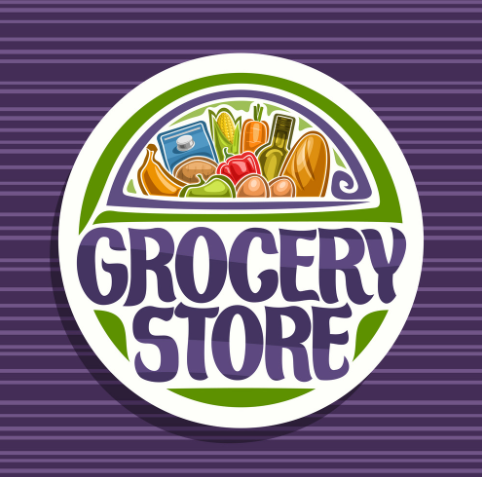

# Grocery Project   &nbsp; 

> This is a simple grocery project that utilizes HTML and CSS to create a grocery list webpage.

## Getting Started

To run the project, follow these steps:

1. Clone the repository or download the project files.
2. Open `grocery.html` in your preferred web browser.

## Project Structure

The project consists of the following files:

- `grocery.html`: The main HTML file that contains the structure and content of the grocery list webpage.
- `style1.css`: The CSS file that defines the styles and layout of the HTML elements.

## Usage

The `grocery.html` file serves as the entry point for the grocery list webpage. Open this file in a web browser to view and interact with the grocery list.

## Customization

You can customize the appearance and layout of the webpage by modifying the `style1.css` file. Feel free to experiment with different CSS styles and properties to suit your preferences.

## Contributing

Contributions to this project are welcome! If you find any issues or have any suggestions for improvements, please submit a pull request or open an issue on the project's repository.

## License

This project is licensed under the [MIT License](LICENSE).

